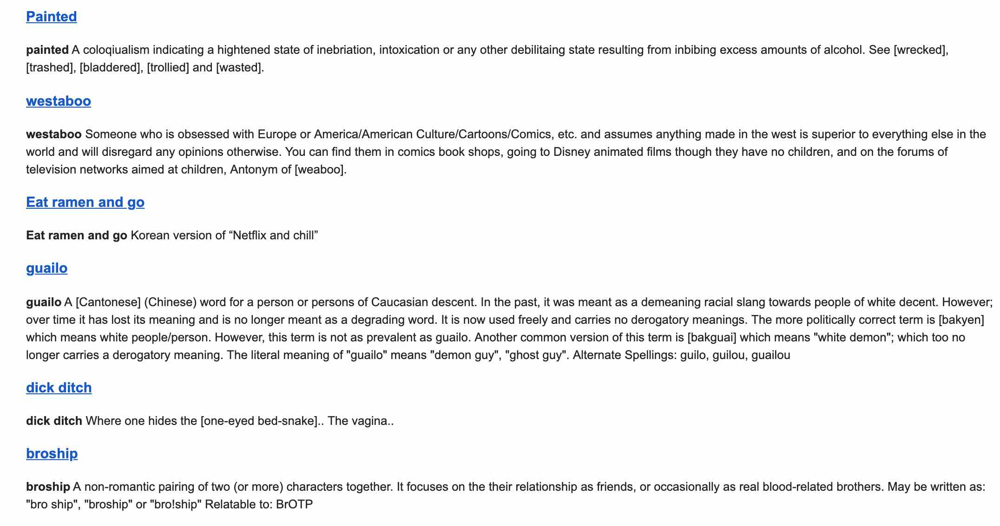

# Urban Dictionary Trends Emailer

Send Urban Dictionary trends email to yours!

## Getting Started

It's very simple tool. You only need Python >= 3.7.0, requests and beautifulsoup4.

### Installing

After downloading via git or zip, install required modules:

```bash
pip install -r requirements.txt
```

Or if you have pipenv simply run:

```bash
pipenv install
```

After installing, make a file called `credentials.json` at the same folder as `fetch_and_email_trend.py` is in with the following content:

```json
{
    "EMAIL": "YOUR GMAIL ADDRESS",
    "PW": "YOUR GMAIL PASSWORD"
}
```

### How to use

In order to send yourself an email through gmail, you need to let gmail allow to be accessed with less secured app. You can change the setting [here](https://myaccount.google.com/lesssecureapps).

And then just simply send yourself laughable, sometimes bizzares words with following command:

```bash
python3 fetch_and_email_trend.py
```

or if with pipenv:

```bash
pipenv run python3 fetch_and_email_trend.py
```

Then voilà:



## Personally

Since I own raspberry pi and run it 24/7, I send myself trend words every morning using cron:

```bash
* 8 * * * cd PATH/TO/PYTHON_FILE.py && python3 fetch_and_email_trend.py # Add it to your crontab
```

## LICENSE

This project is licensed under the MIT License - see the [LICENSE.md](LICENSE.md) file for details